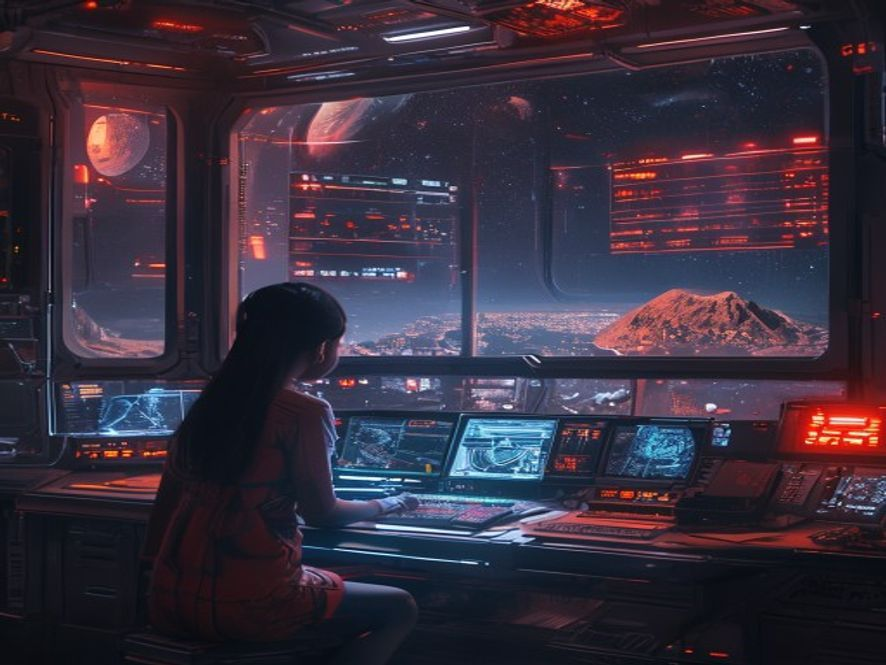

# Scene 1: Sinyal dari Mars

**Setting:** Stasiun Galaksi — Ruang Kontrol Utama — Malam hari
**Karakter:** Bintang (pelajar magang, 17 tahun)

Malam ini jadwal jaga Bintang sendirian di ruang kontrol Stasiun Galaksi. Sepi. Hanya suara mesin dan lampu indikator yang berkedip-kedip pelan.

Tiba-tiba... **BIP... BIP... BIP.**

Alarm sinyal masuk. Bintang cek layar — ada transmisi dari arah Mars. Tapi itu mustahil. Koloni Mars sudah mati 50 tahun lalu. Semua orang tahu itu.

Bintang makin penasaran saat melihat data awal — ini bukan sinyal random. Ini sinyal terstruktur. Seperti pesan. Sengaja dikirim. **Dari Mars.**

Jantung Bintang berdebar-debar. Ini penemuan besar. Tapi juga... agak menyeramkan.

---

**Pilihan:**
- [Scene 02A]: Riset sinyal ini dari lab komputer, cari tahu asalnya
- [Scene 02B]: Kirim balik sinyal, jawab siapa kamu
