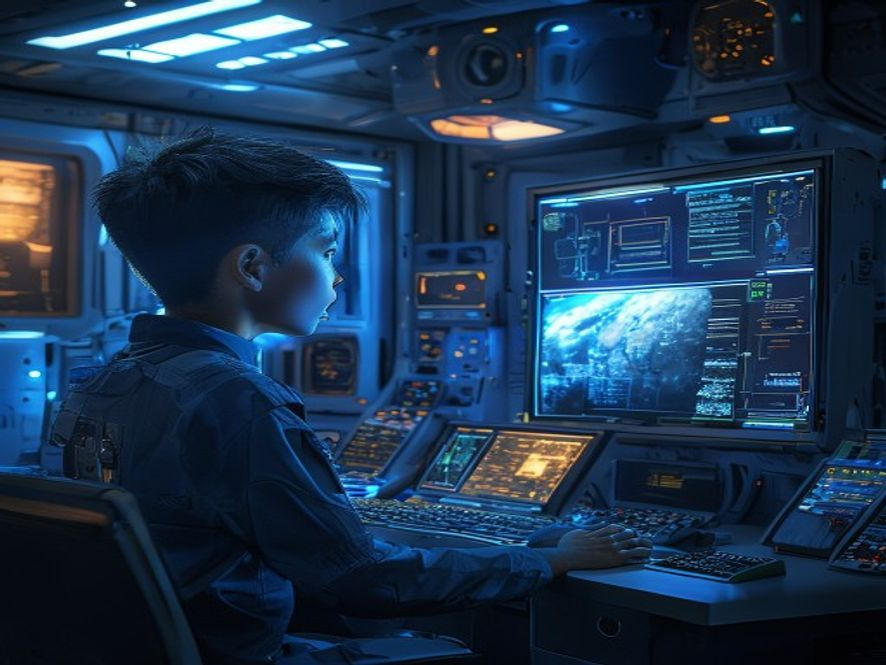

**Setting:** Stasiun Galaksi — Ruang Komunikasi
**Karakter:** Bintang

"Nekat," bisik Bintang, sebelum menekan tombol TRANSMIT.

"Siapa kamu?"

Satu kalimat pendek dari Bintang meluncur ke Mars. 5 menit. 10 menit. Bintang mulai ragu — mungkin hanya noise.

**BIP.**

Layar berkedip. Ada balasan.

Satu kata.

**"Aku."**

Bintang hampir jatuh dari kursi. *Ada yang menjawab. Dari Mars. 50 tahun setelah koloni mati!*

Dengan tangan gemetar, Bintang lanjut berkomunikasi.

"Siapa 'aku'?"

Balasannya datang lebih cepat kali ini. Bukan satu kata, tapi pesan panjang. Bintang kaget saat membaca isinya — isi pesan ini tidak mungkin diketahui orang lain.

---

**Pilihan (otomatis lanjut):**
- [Scene 03B]: Baca pesan selengkapnya
