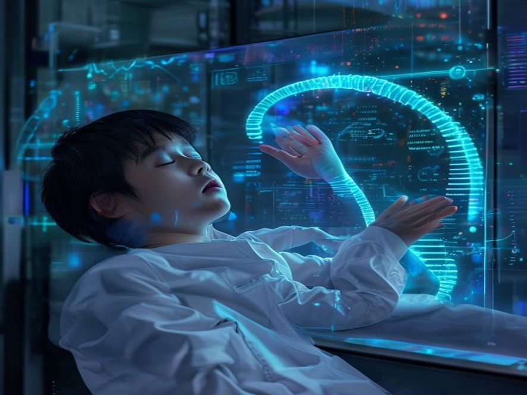

# Scene 3A: DNA 99.9% Cocok

**Setting:** Stasiun Galaksi — Lab Komputer — Pagi buta
**Karakter:** Bintang

Bintang sudah begadang semalaman, tapi tidak peduli. Data sudah terkumpul. Dan hasilnya tidak masuk akal.

Dia mengecek sidik jari genetik prosedur standar untuk verifikasi asal sinyal biologis. Dan hasilnya membuat Bintang tercengang:

Kecocokan DNA: 99.9% — SAMPLE: BINTANG — SUMBER: MARS

"Gila..." bisik Bintang. DNA-ku ada di Mars?!

Bintang cek ulang tiga kali hasilnya sama.

Sinyal itu bukan dari alien, bukan dari koloni Mars, sinyal itu dari seseorang yang secara genetik identik dengan Bintang.

Tapi bagaimana caranya?!

Bintang harus mencari tahu lebih lanjut. Ada yang janggal di data komunikasi sepertinya ada informasi tambahan yang disembunyikan.

---

**Pilihan (otomatis lanjut):**
- [Scene 04]: Cari tahu kebenarannya
