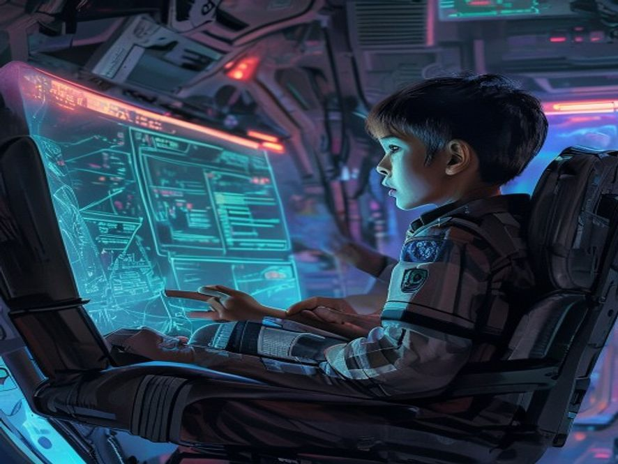

# Scene 3B: Pesan dari Masa Depan

**Setting:** Stasiun Galaksi — Ruang Komunikasi
**Karakter:** Bintang

Pesan dari Mars itu panjangan dan isinya membuat Bintang merinding.

Bukan soal Mars, bukan soal alien, tapi soal Bintang sendiri.

Orang di ujung sana tahu nama lengkap Bintang, tanggal lahir, makanan favorit, nama panggilan yang hanya ibu yang tahu, bahkan kenangan kecil saat umur 5 tahun, kejadian yang tidak mungkin diketahui orang lain.

KECUALI...

"Bagaimana dia tahu semua ini?" Bintang menggenggam kursi erat-erat.

Pesan terakhirnya makin menyeramkan:

"Kamu pasti bingung, tapi percaya, aku tahu semua ini karena aku dulu persis seperti kamu. Aku Bintang, Bintang yang 20 tahun lebih tua."

Darah Bintang serasa berhenti mengalir.

---

**Pilihan (otomatis lanjut):**
- [Scene 04]: Terima apa adanya, hadapi kenyataan
