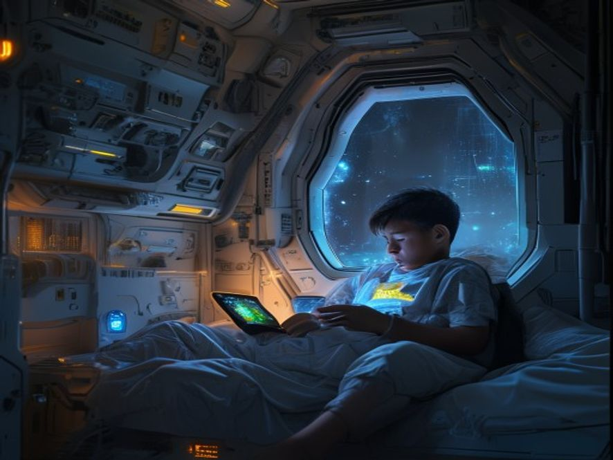

# Scene 4: Pilihan Terakhir

**Setting:** Stasiun Galaksi — Kamar Pribadi Bintang
**Karakter:** Bintang

Bintang duduk di tepi tempat tidur, layar tablet di tangan. Semua data sudah terkumpul, semua potongan puzzle tersambung. Dan jawabannya...

Sinyal dari Mars itu bukan dari alien, bukan dari koloni yang mati. Tapi dari...

Diri Bintang sendiri.

Bintang versi masa depan yang entah bagaimana caranya terdampar di Mars, mungkin misi rahasia, mungkin kecelakaan. Yang jelas, Bintang masa depan sudah 10 tahun terdampar di sana, sendirian, menggunakan peralatan darurat koloni untuk mengirim sinyal ke masa lalu ke Bintang yang sekarang.

Pesan audio terakhir dari Mars mulai diputar. Suaranya... suara Bintang sendiri. Tapi lebih tua, lebih lelah, lebih patah.

"Halo, diriku yang dulu, aku tahu ini gila. Tapi aku hanya ingin bilang, aku di sini karena pilihan yang salah. Satu keputusan bodoh yang membuatku terdampar di sini. Aku kirim sinyal ini ke masa lalu, ke kamu. Tolong, jangan ulangi kesalahanku. Aku percaya kamu bisa..."

Pesan terputus, statis.

Bintang dihadapkan pada pilihan.

---

**Pilihan Akhir:**
- [Scene 05A]: Coba komunikasi balik, tanya apa yang sebenarnya terjadi
-[Scene 05B]: Cari cara ke Mars, selamatkan Bintang masa depan
- [Scene 05C]: Diam saja, pantau terus dari jauh
