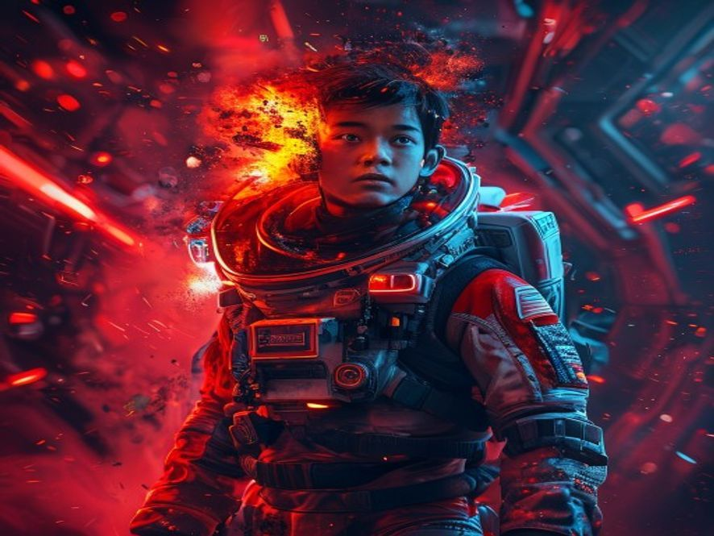

# Scene 5B: Pesawat Hancur

**Setting:** Luar Angkasa — Pesawat Darurat
**Karakter:** Bintang 🏁

**Status: END — GAME OVER**

"Aku akan ke Mars."

Bintang nekat. Membajak pesawat darurat stasiun dan meluncur ke Mars sendirian. Perjalanan 3 bulan penuh risiko.

Hari ke-45... **BOOM.**

Panel oksigen meledak. Alarm meraung. Oksigen bocor perlahan.

"Tidak... tidak!" Bintang panik, mencoba memperbaiki. Tapi terlalu lambat.

Pesawat mulai hancur. Pendingin mati. Suhu turun drastis.

Di Mars, seseorang menunggu. Bintang masa depan tahu — karena dia juga pernah membuat pilihan yang sama.

Satu sinyal terakhir dikirim dari pesawat yang sekarat:

*"Maaf... aku gagal. Tapi tenang. Aku di jalan yang sama... sekarang aku akan bersamamu."*

Di permukaan Mars, Bintang masa depan memejamkan mata. Satu titik cahaya melintas di langit.

Mereka akhirnya bersatu lagi. Di Mars. Selamanya.

🏁 **SAD ENDING** — Jangan ulangi kesalahan yang sama...

---

Status: END
