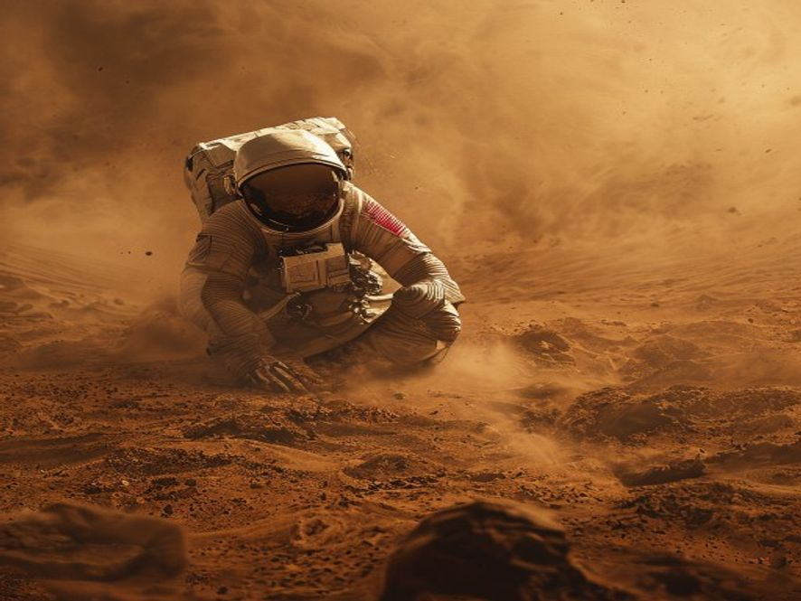

**Setting:** Stasiun Galaksi — Berbulan-bulan kemudian
**Karakter:** Bintang 🏁

**Status: END — ???**

Bintang memutuskan buat diem aja.

Nggak jawab. Nggak cari cara ke Mars. Cuma pantau sinyal itu dari jauh.

3 hari kemudian... sinyalnya berhenti.

---

Bintang nggak pernah tahu apa yang terjadi. Apakah Bintang masa depan masih hidup? Apakah dia menunggu? Atau udah...

Yang Bintang tahu—setiap malam, dia liat ke arah titik merah Mars dan bertanya-tanya.

*Apa yang bakal terjadi kalo aku jawab?*

---

**10 tahun kemudian.**

Bintang lulus jadi astronot. Diterima di misi pertama—ke Mars. Akhirnya.

Pesawat mendarat di permukaan Mars. Debu merah beterbangan. Bintang melangkah keluar, napas pertama di planet asing.

Dan di sana, di antara debu dan bebatuan...

Bintang nemuin sesuatu. Barang kecil. Terkubur separuh.

Sebuah **gelang**. Identik persis dengan gelang yang Bintang pakai sekarang. Tapi usang. Lapuk. Udah puluhan tahun di sini.

Bintang terpaku. Waktu terasa berhenti.

"...Aku yang ninggalin ini," bisik Bintang. "Atau... dia?"

Di kejauhan, radio komunikasi berbunyi pelan.

Suara statis.

*BIP... BIP...*

🏁 **MYSTERY ENDING** — Lingkaran waktu masih terus berputar...

---

Status: END
