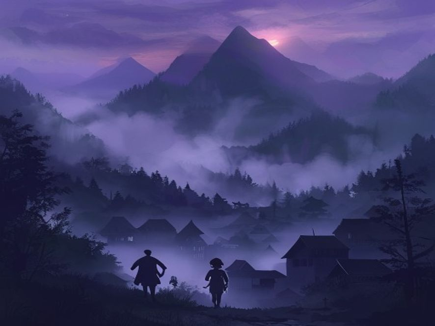

# Scene 1: Kabut Pertama

**Setting:** Kampung terpencil di pegunungan, sore hari menjelang maghrib
**Karakter:** Junior

---

Junior baru pulang dari warung. Langit pun sudah mulai gelap, tapi yang membuat dia berhenti melangkah, ada kabut tebal turun dari atas gunung. Turunnya cepet sekali. Dalam 5 menit, kampung mulai diselimuti oleh kabut.

Tapi yang aneh, kabutnya berhenti tepat di pinggir kampung, antara kampung dan gunung ada batas yang rapi seperti ada tembok kaca.

Junior manggut-manggut.

"Baru liat kabut kayak gini..."

Terus dari dalam kabut terdengar suara bisik-bisik samar.

Junior menengok kanan kiri tetapi tidak ada orang, suara itu masih terdengar seperti ada yang memanggil namanya.

"Juuunior..."

---

**Pilihan:**
- [Scene 2A]: Selidiki kabut sendirian
- [Scene 2B]: Ajak temen buat nyelidikin bareng
