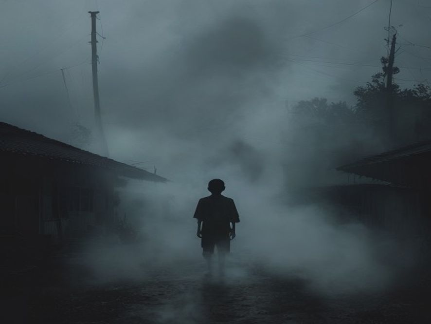

# Scene 2A: Sendirian di Kabut

**Setting:** Pinggir kabut, kampung pegunungan
**Karakter:** Junior

---

Junior mengatur napas, kakinya maju perlahan ke arah kabut yang dingin. Udara di dekat kabut terasa berbeda seperti masuk ke dalam kulkas raksasa.

"Hello?" bisik Junior.

Kabutnya bergerak pelan tetapi seperti memberi jalan. Ada lorong kecil diantara kabut tebal, lorong yang cuma muat satu orang.

Bisikan itu terdengar lagi lebih jelas : "Masuk... Jangan takut..."

Junior menengok ke belakang. Rumah-rumah sudah jauh, kampung terlihat sunyi, sepertinya semua orang diam di rumah masing-masing.

---

**Pilihan:**
- [Scene 3A]: Masuk lebih dalam ke lorong kabut
- Lari pulang... tetapi kabut sudah menutupi jalan → Scene 3B
