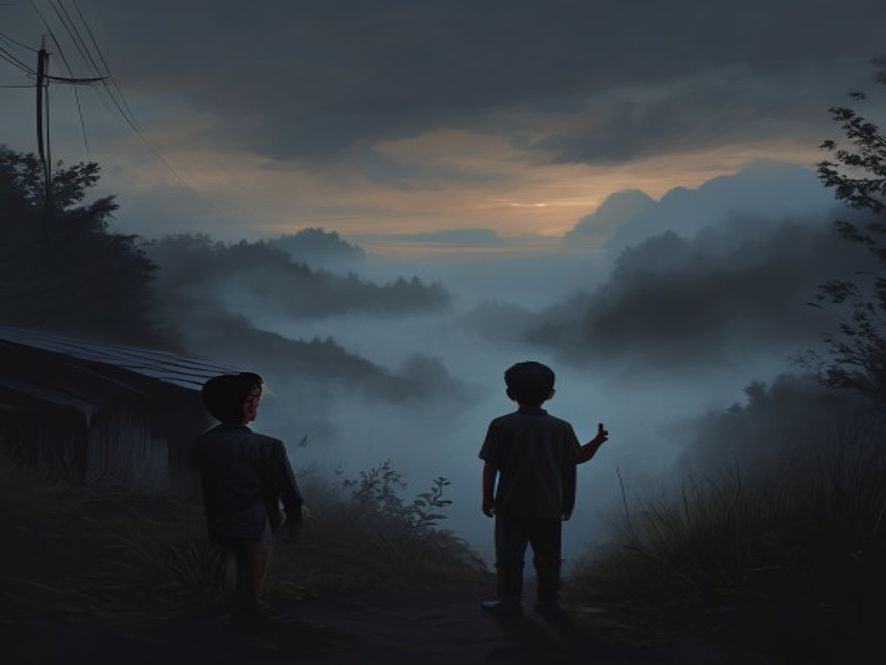

# Scene 2B: Berdua Ngintip dari Jauh

**Setting:** Pinggir kampung, sore-sore mau maghrib
**Karakter:** Junior, David (temen sekelas)

---

Junior menarik tangan David, teman sebangkunya yang sedang bermain di pos ronda.

"Dav, liat tuh!" tunjuk Junior ke kabut.

David melotot. "Itu apaan? Kok tebel amat?"

"Aneh," kata Junior. "Itu... yang bisikin aku tadi."

David menengok ke Junior, mukanya pucat. "Bisik? Yang bisik?"

Tiba-tiba, kabut bergerak seperti ada yang jalan di dalamnya. David refleks menarik tangan Junior buat segera pergi, tetapi Junior menahannya.

"Bentar, Dav. Kita liat dulu dari sini."

---

**Pilihan:**
- [Scene 3A]: Mendekat pelan-pelan buat liat lebih jelas
- [Scene 3B]: Balik badan, lapor orang dewasa
