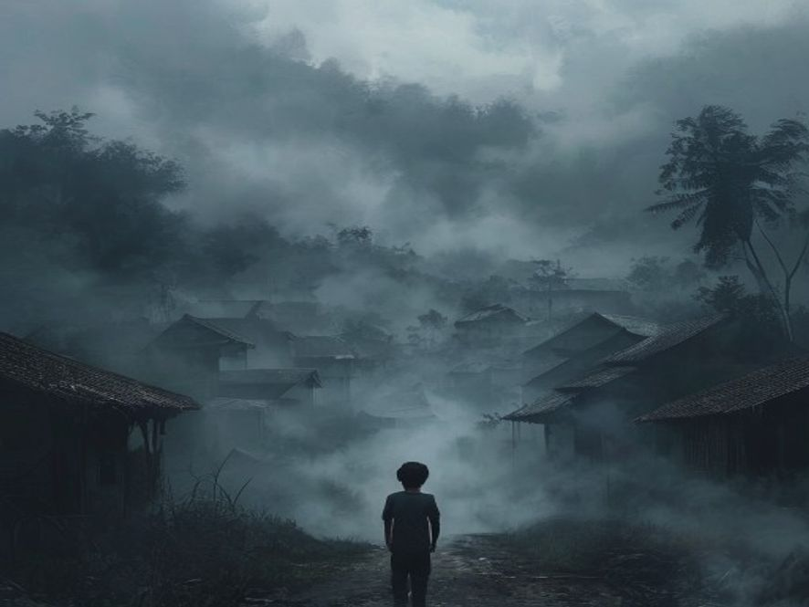

# Scene 3B: Jalan Pulang Tertutup Kabut

**Setting:** Pinggir kampung, mulai gelap
**Karakter:** Junior (dan David kalo lewat 2B)

---

Junior muter badan mau lari — tapi ga bisa.

Kabut udah nutup jalan pulang. Ga cuma di depan, tapi di semua arah. Kampungnya sekarang DIKEPUNG kabut tebal. Kayak benteng putih raksasa yang nutup seluruh desa.

Suara bisik-bisik mulai dateng dari segala penjuru. Pelan, tapi makin lama makin keras:

"Kembaliiii..."
"Juniorrr... kembaliiii..."
"Ini rumahmuuuu..."

Junior megang kepala. Suara itu terasa familiar. Kayak pernah denger. Tapi dari mana?

Bisikan itu ngenalin namanya dengan cara yang cuma orang TERDEKAT yang tau.

---

**Pilihan:**
- [Scene 4]: Junior berusaha ingat — siapa pemilik suara itu?
