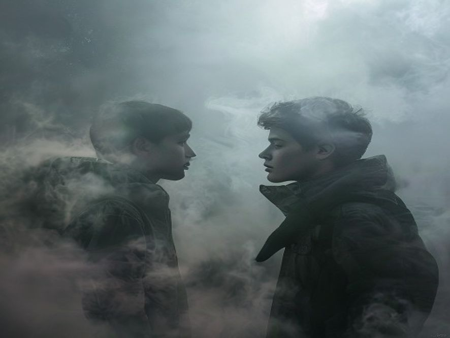

# Scene 4: Junior & Kabut — Rahasia Terungkap (TWIST!)

**Setting:** Dalam kabut, antara dunia nyata dan... sesuatu yang lain
**Karakter:** Junior, Bayangan misterius
*<!-- Status: END -->*

---

Bayangan di depan Junior semakin jelas. Bukan lagi bayangan melainkan sekarang wujudnya seperti orang beneran. Cowok, 17 tahunan, pakai jaket gunung. Mukanya... mirip Junior.

"Kakak..." bisik Junior, matanya melebar.

Cowok itu menyeringai. "Akhirnya kamu inget juga, Jun."

"Ya Tuhan, kamu kira aku bakal lupa?" Junior menahan tangis. "Kamu hilang 3 tahun lalu pas naik gunung. Mereka bilang kamu... kamu udah ga ada."

"Bener," kata kakaknya Senior. "Aku emang udah ga ada, tapi... menguap hilang, Jiwa aku nyangkut di puncak sedang menunggu."

"Menunggu apa?"

"Menunggu kamu, karena cuma kamu yang bisa denger suara aku. Karena kita... kembar, bukan kembar identik biasa, jiwa kita tersambung."

Junior terdiam. Kakaknya pernah cerita soal itu dulu, perasaan aneh kalo salah satu lagi susah, tapi Junior tidak pernah percaya.

"Sekarang kamu percaya?" Senior menyeringai.

---

**Pilihan:**
- [Scene 5A]: Junior percaya & ngikutin bisikan kakaknya
- [Scene 5B]: Junior nolak & kabur — ini ga masuk akal!
