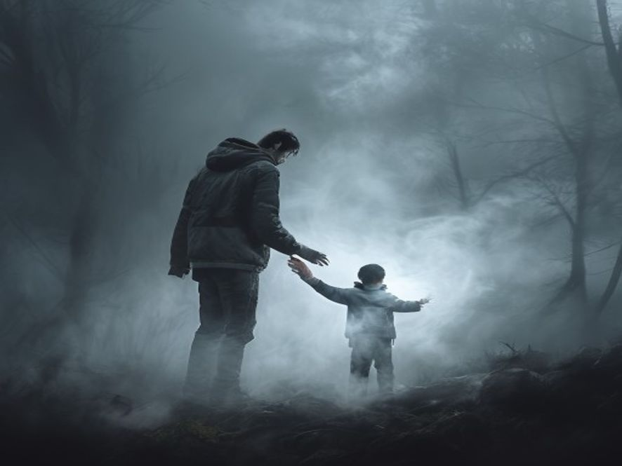

# Scene 5A: Junior Percaya

**Setting:** Dalam kabut, bersama kakaknya Senior
**Karakter:** Junior, Senior (arwah kakak)

---

Junior tarik napas dalam. "Oke, Kak Aku percaya, terus... yang harus aku lakukan apa?"

Senior menghela napas. Kabut di sekelilingnya bergetar. "Aku butuh bantuan kamu, Jun, jiwa aku ga bisa tenang di sini, Nyangkut di antara dua dunia, karena pas aku jatuh dulu, aku ga sendirian."

Junior merinding. "Maksud Kakak?"

"Ada sesuatu di gunung ini. Kekuatan kuno yang mengunci jiwa orang-orang yang mati di sini. Kabut ini bukan kabut biasa, ini penjara buat arwah. Dan aku butuh kamu buat ngelupasin aku."

"Caranya?"

Senior mengulurkan tangan. "Ikut aku ke puncak. Di sana ada batu besar namanya batu penjara. Kalo kamu pecahin... aku bebas."

Kabut mulai berputar-putar di sekeliling mereka. Angin dingin berhembus kencang.

---

**Pilihan:**
- [Scene 6A 🏁]: Junior pegang tangan kakaknya dan ikut ke puncak
