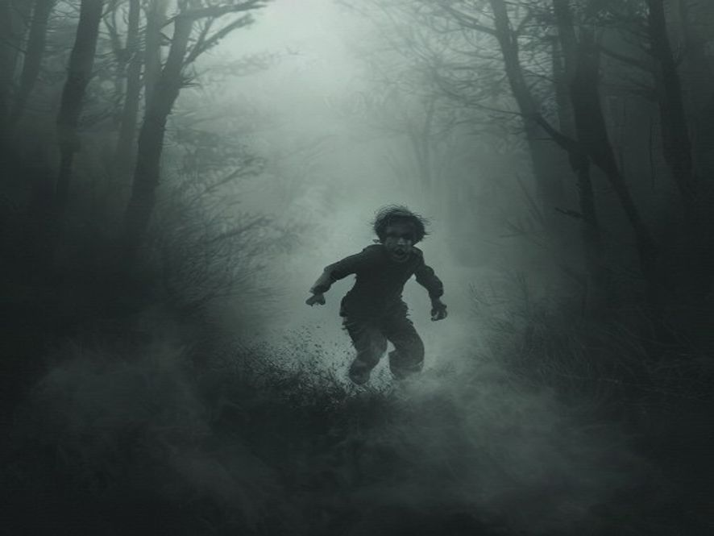

# Scene 5B: Junior Kabur

**Setting:** Dalam kabut, Junior mundur perlahan
**Karakter:** Junior, Senior (arwah kakak)

---

Junior menggoyangkan kepala. "Nggak. Nggak... ini ga mungkin. Kakak udah mati. Orang mati ga bisa kembali!"

Senior mukanya sedih. "Jun..."

"AKU PULANG!" teriak Junior, lalu memutarkan badan dan lari.

Tetapi kabut di sekelilingnya semakin tebal. Walaupun lari kemana saja, yang keluar hanya putih semua, tidak ada jalan, tidak ada kampung, tidak ada apa-apa, kecuali suara kakaknya yang berbisik dari segala arah:

"Jun... jangan lari..."
"Kakak ga akan nyakitin kamu..."
"Kakak cuma butuh bantuan..."

Junior menutup telinga rapat-rapat. Tetapi suara itu terus menyusup seperti langsung ke kepala.

KABUT MULAI MENGEJAR. 😱

---

**Pilihan:**
- [Scene 6B 🏁]: Junior terus lari... atau berhenti dan hadapin?
