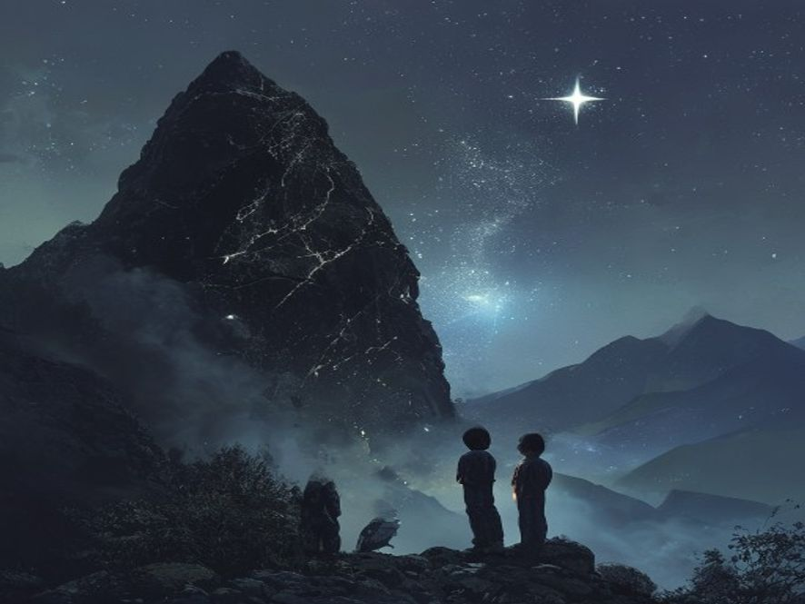

# Scene 6A: Bebas! 🏁 (Ending A)

**Setting:** Puncak gunung, di depan batu besar hitam
**Karakter:** Junior, Senior (arwah kakak)

---

Junior dan kakaknya naik ke puncak. Dingin banget. Tapi ada batu hitam besar di tengah-tengah — dari batu itu kabut putih terus keluar kayak asap.

"Ini dia," kata Senior. "Batu penjara."

Junior melihat batu itu. Ada ukiran aneh di permukaannya, seperti tulisan kuno. Tanpa mikir panjang, Junior mengangkat batu di dekatnya dan memukul batu hitam itu.

BRAK!

Batu hitam itu retak, cahaya terang menyembur dari celah-celahnya. Kabut di sekeliling mereka mulai menghilang kehisap ke dalam retakan.

Senior mulai bersinar, kakinya perlahan berubah jadi titik-titik cahaya.

"Kak!" teriak Junior.

Senior menyeringai, matanya berkaca-kaca, "Makasih, Jun. Kamu berhasil."

"Kakak mau ke mana?!"

"Tenang aja, Kakak sekarang beneran bebas." ... "Jaga diri kamu adek ku dan ingat kalo suatu saat kamu butuh kakak kamu tau di mana mencari kakak."

Senior menghilang, kabut menghilang total dari kampung, orang-orang melihat puncak gunung bersinar terang seperti bintang jatuh.

Junior berdiri di puncak sendirian, menangis tapi juga senyum.

Di langit, satu bintang bersinar lebih terang dari yang lain. Kedip-kedip, Junior tau itu kakaknya.

🏁 **END — KAKAK BEBAS** 💫

<!-- Status: END -->

---

[🔄 Main Lagi](scene-01.md)
