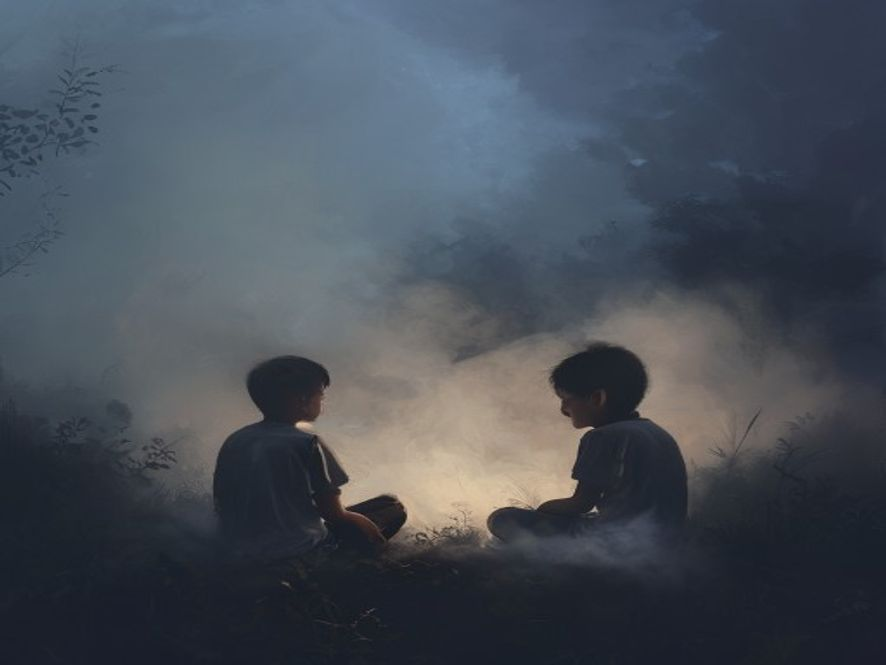

# Scene 6B: Terjebak Selamanya 🏁 (Ending B)

**Setting:** Dalam kabut — ruang kosong tanpa ujung
**Karakter:** Junior, Senior (arwah kakak)

---

Junior berlari, kakinya terasa mau copot. Tapi kabut di depan, belakang, kiri, kanan sama saja.

Akhirnya dia berhenti, napasnya tersengal, jantungnya mau meledak.

"Sudah..." bisik Senior, muncul dari balik kabut wajahnya sedih. "Jun, kalo kamu terus lari kamu ga akan menemukan jalan keluar."

Junior duduk lemas, air mata menetes. "Aku takut Kak..."
 
Senior duduk di sampingnya, kabut di sekitar mereka mulai tenang. "Kakak tau maaf kakak ga maksa kamu cuma ini satu-satunya cara kakak ketemu kamu lagi."

Junior menengok ke kakaknya, "terus sekarang gimana?"

Senior melihat ke langit yang di dalam kabut cuma putih semua, "kita tunggu."

"Tunggu apa?"

"Sampe kamu siap."

Kampung tidak pernah melihat Junior lagi. Kabut bertahan 3 hari, lalu hilang. Tapi beberapa orang bilang, kalo malem-malem di pinggir gunung kadang kedengeran suara dua anak kecil ketawa, ngobrol, di antara kabut tipis yang turun.

🥲 **END — TERJEBAK BERSAMA** 🌫️

<!-- Status: END -->

---

[🔄 Main Lagi](scene-01.md)
